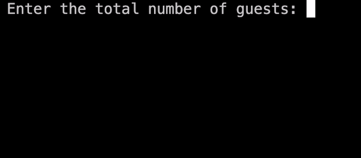

# COP4520 Assignment 2

C++ Solution to **Problem 1**: [Minotaur's Birthday Party](https://github.com/soleil-cordray/COP4520-Assignment-2/blob/main/problem1.cpp) and **Problem 2**: [Minotaur's Crystal Vase](https://github.com/soleil-cordray/COP4520-Assignment-2/blob/main/problem2.cpp).

## Prerequisites

-   C++ compiler (g++) with C++11 support.
-   Git (for cloning the repository).

### 1. Check Prerequisite Installations

-   **GCC (g++):** `g++ --version`
-   **Git:** `git --version`

### 2. Install Prerequisites

-   **GCC (g++):**
    -   **Linux (Ubuntu/Debian):**
        ```sh
        sudo apt-get update
        sudo apt-get install g++
    -   **macOS:** `xcode-select --install`
    -   **Windows:** Install [MinGW](https://www.mingw-w64.org/) or [Cygwin](https://cygwin.com/) to get the g++ compiler.
-   **Git:**
    -   **Linux (Ubuntu/Debian):**
        ```sh
        sudo apt-get update
        sudo apt-get install git
    -   **macOS:**
        - Check Homebrew installation: `brew --version`
        - Install [Homebrew](https://brew.sh/) if not installed already.
        - Run: `brew install git`
    -   **Windows:**
        - Download and install [Git for Windows](https://gitforwindows.org/).

### 3. Clone Repository
```sh
git clone https://github.com/soleil-cordray/COP4520-Assignment-2.git
cd COP4520-Assignment-2
```

## Problem 1

The Minotaur invited N guests to his birthday party. When the guests arrived, he made the following announcement.

The guests may enter his labyrinth, one at a time and only when he invites them to do
so. At the end of the labyrinth, the Minotaur placed a birthday cupcake on a plate. When
a guest finds a way out of the labyrinth, he or she may decide to eat the birthday
cupcake or leave it. If the cupcake is eaten by the previous guest, the next guest will find
the cupcake plate empty and may request another cupcake by asking the Minotaur’s
servants. When the servants bring a new cupcake the guest may decide to eat it or leave
it on the plate.

The Minotaur’s only request for each guest is to not talk to the other guests about her or
his visit to the labyrinth after the game has started. The guests are allowed to come up
with a strategy prior to the beginning of the game. There are many birthday cupcakes, so
the Minotaur may pick the same guests multiple times and ask them to enter the
labyrinth. Before the party is over, the Minotaur wants to know if all of his guests have
had the chance to enter his labyrinth. To do so, the guests must announce that they have
all visited the labyrinth at least once.

Now the guests must come up with a strategy to let the Minotaur know that every guest
entered the Minotaur’s labyrinth. It is known that there is already a birthday cupcake left
at the labyrinth’s exit at the start of the game. How would the guests do this and not
disappoint his generous and a bit temperamental host?

Create a program to simulate the winning strategy (protocol) where each guest is
represented by one running thread. In your program you can choose a concrete number
for N or ask the user to specify N at the start.

### Strategy

To ensure that all guests visit the labyrinth exactly once and the Minotaur is informed when this is completed:

- Designate one guest as the leader who keeps track of how many guests have visited the labyrinth.
- Other guests (non-leaders) will enter the labyrinth and, if it's their first visit, eat the cupcake.
- Once a non-leader eats a cupcake, they will not eat it again on subsequent visits.
- The leader will only eat a cupcake when they find the plate empty, which signals that a new guest has visited.
- The leader keeps count of how many unique visits have occurred.
- The process continues until the leader has counted that all guests have visited the labyrinth.
- The leader will then make the announcement once they have confirmed that all guests have visited at least once.

The provided C++ program simulates this protocol using threads to represent guests. Each thread acquires a lock on a shared mutex to enter the critical section where they interact with the shared cupcake variable. A condition variable is used to synchronize the eating and replacement of the cupcake.

### Demo


### Run

1. Open your terminal and navigate to the directory containing the `problem1.cpp` file (see [Clone Repository](#3-clone-repository)).
2. Compile: `g++ -std=c++11 -pthread problem1.cpp -o problem1`
3. Run: `./problem1`
4. Enter the total number of guests when prompted.

## Problem 2

The Minotaur decided to show his favorite crystal vase to his guests in a dedicated
showroom with a single door. He did not want many guests to gather around the vase
and accidentally break it. For this reason, he would allow only one guest at a time into
the showroom. He asked his guests to choose from one of three possible strategies for
viewing the Minotaur’s favorite crystal vase:

1) Any guest could stop by and check whether the showroom’s door is open at any time
and try to enter the room. While this would allow the guests to roam around the castle
and enjoy the party, this strategy may also cause large crowds of eager guests to gather
around the door. A particular guest wanting to see the vase would also have no
guarantee that she or he will be able to do so and when.

2) The Minotaur’s second strategy allowed the guests to place a sign on the door
indicating when the showroom is available. The sign would read “AVAILABLE” or
“BUSY.” Every guest is responsible to set the sign to “BUSY” when entering the
showroom and back to “AVAILABLE” upon exit. That way guests would not bother trying
to go to the showroom if it is not available.

3) The third strategy would allow the quests to line in a queue. Every guest exiting the
room was responsible to notify the guest standing in front of the queue that the
showroom is available. Guests were allowed to queue multiple times.

Which of these three strategies should the guests choose? Please discuss the advantages
and disadvantages.

Implement the strategy/protocol of your choice where each guest is represented by 1
running thread. You can choose a concrete number for the number of guests or ask the
user to specify it at the start.

### Strategy

The implemented strategy (third option) in the code for managing guest visits to the Minotaur's showroom is a queuing system, where each guest is represented by a thread that accesses the showroom in a pre-determined order.

**Advantages:**

- **Fair Access**: Each thread (guest) accesses the showroom in a first-come, first-served basis, ensuring each guest has a chance to visit.
- **No Race Conditions**: With the mutex lock, only one guest (thread) can access the showroom at a time, eliminating the chance of race conditions.
- **Simple Synchronization**: The condition variable effectively manages the order of guest visits without the need for complex synchronization mechanisms.

**Disadvantages:**

- **Limited Parallelism**: The queuing system does not utilize potential parallelism in a multi-core system, as guests visit the showroom one at a time.
- **Increased Wait Time**: Threads are blocked until it is their turn, which can lead to increased wait times, especially with a large number of guests.

Note that the program pauses for 1 second during each guest visit to simulate the visit duration.

### Demo 



### Run

1. Open your terminal and navigate to the directory containing the `problem2.cpp` file (see [Clone Repository](#3-clone-repository)).
2. Compile: `g++ -std=c++11 -pthread problem2.cpp -o problem2`
3. Run: `./problem2`
4. Enter the total number of guests when prompted.

## Troubleshooting

- If you encounter any compilation errors, ensure you have the correct permissions and that your g++ installation is up to date with C++11 support.
- If you face issues with the pthread library on Windows, make sure you have the correct threading library for your setup or seek equivalent compilation flags for MinGW or Cygwin.