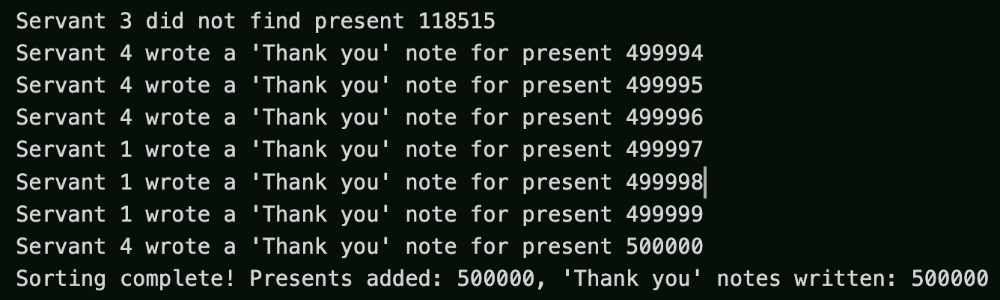
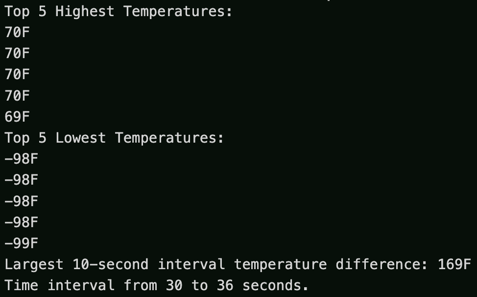

# COP4520-Assignment-3

C++ Solution to **Problem 1**: [The Birthday Presents Party](https://github.com/soleil-cordray/COP4520-Assignment-3/blob/main/problem1.cpp) and **Problem 2**: [Atmospheric Temperature Reading Module](https://github.com/soleil-cordray/COP4520-Assignment-3/blob/main/problem2.cpp).

## Prerequisites

-   C++ compiler (g++) with C++11 support.
-   Git (for cloning the repository).

### 1. Check Prerequisite Installations

-   **GCC (g++):** `g++ --version`
-   **Git:** `git --version`

### 2. Install Prerequisites

-   **GCC (g++):**
    -   **Linux (Ubuntu/Debian):**
        ```sh
        sudo apt-get update
        sudo apt-get install g++
        ```
    -   **macOS:** `xcode-select --install`
    -   **Windows:** Install [MinGW](https://www.mingw-w64.org/) or [Cygwin](https://cygwin.com/) to get the g++ compiler.
-   **Git:**
    -   **Linux (Ubuntu/Debian):**
        ```sh
        sudo apt-get update
        sudo apt-get install git
        ```
    -   **macOS:**
        -   Check Homebrew installation: `brew --version`
        -   Install [Homebrew](https://brew.sh/) if not installed already.
        -   Run: `brew install git`
    -   **Windows:**
        -   Download and install [Git for Windows](https://gitforwindows.org/).

### 3. Clone Repository

```sh
git clone https://github.com/soleil-cordray/COP4520-Assignment-3.git
cd COP4520-Assignment-3
```

# Problem 1: The Birthday Presents Party

The Minotaur’s birthday party was a success. The Minotaur received a lot of presents
from his guests.

The next day he decided to sort all of his presents and start writing
“Thank you” cards. Every present had a tag with a unique number that was associated
with the guest who gave it. Initially all of the presents were thrown into a large bag with
no particular order.

The Minotaur wanted to take the presents from this unordered bag
and create a chain of presents hooked to each other with special links (similar to storing
elements in a linked-list). In this chain (linked-list) all of the presents had to be ordered
according to their tag numbers in increasing order. The Minotaur asked 4 of his servants
to help him with creating the chain of presents and writing the cards to his guests. Each
servant would do one of three actions in no particular order:

1. Take a present from the unordered bag and add it to the chain in the correct location by
   hooking it to the predecessor’s link. The servant also had to make sure that the newly added
   present is also linked with the next present in the chain.
2. Write a “Thank you” card to a guest and remove the present from the chain. To do so, a
   servant had to unlink the gift from its predecessor and make sure to connect the predecessor’s
   link with the next gift in the chain.

3. Per the Minotaur’s request, check whether a gift with a particular tag was present in the
   chain or not; without adding or removing a new gift, a servant would scan. through the chain
   and check whether a gift with a particular tag is already added to the ordered chain of gifts
   or not.

As the Minotaur was impatient to get this task done quickly, he instructed his servants not to wait
until all of the presents from the unordered bag are placed in the chain of linked and ordered
presents. Instead, every servant was asked to alternate adding gifts to the ordered chain and writing
“Thank you” cards. The servants were asked not to stop or even take a break until the task of writing
cards to all of the Minotaur’s guests was complete.

After spending an entire day on this task the bag of unordered presents and the chain of ordered
presents were both finally empty! Unfortunately, the servants realized at the end of the day that
they had more presents than “Thank you” notes. What could have gone wrong? Can we help the Minotaur
and his servants improve their strategy for writing “Thank you” notes?

Design and implement a concurrent linked-list that can help the Minotaur’s 4 servants with this task.
In your test, simulate this concurrent “Thank you” card writing scenario by dedicating 1 thread per
servant and assuming that the Minotaur received 500,000 presents from his guests.

## Strategy

### Old Strategy Fallbacks:

-   **Asynchronous Addition/Removal:** the old algorithm allows servants to add presents to the list faster than they're being removed and written "Thank you" notes for. This could lead to an accumulation of unprocessed presents.
-   **Imbalanced Task Allocation:** the old algorithm allows for servants to not equally distribute between adding and removing tasks, and if more time is spent adding presents than "Thank you" notes, this could lead to an accumulation of unprocessed presents.
-   **Incorrect Synchronization:** if the old algorithm is not properly synchronized, this could allow servants to add more presents when the priority should be on writing "Thank you" notes for existing presents.

### New Strategy Improvements:

-   **Dynamic Task Allocation:** servants dynamically switch between adding presents and writing "Thank you" notes based on the system's current needs. If the number of presents waiting to be processed exceeds a certain threshold, servants focus on writing "Thank you" notes to balance the workload and prevent backlog.

-   **Improved Synchronization:** servants wait on a condition variable that is signaled when there are presents to be processed or space to add more presents. This minimizes idle time and ensures that servants are actively working on tasks as needed.

-   **Efficient Search Operations:** search operations take a snapshot of the current list state, reducing the time the list is locked and allowing other servants to concurrently modify the list. This snapshot approach minimizes the impact on the overall system's performance.

-   **Monitoring and Adjustment:** The system continuously monitors the count of presents and "Thank you" notes to ensure a balanced workload among servants. This dynamic adjustment helps maintain a steady flow of task completion and prevents any single task type from dominating the system.

## Demo



## Run

1. Open your terminal and navigate to the directory containing the `problem1.cpp` file (see [Clone Repository](#3-clone-repository)).
2. Compile: `g++ -std=c++11 -pthread problem1.cpp -o problem1`
3. Run: `./problem1`
4. Enter the total number of guests when prompted.

# Problem 2: Atmospheric Temperature Reading Module

You are tasked with the design of the module responsible for measuring the atmospheric temperature of
the next generation Mars Rover, equipped with a multicore CPU and 8 temperature sensors. The sensors
are responsible for collecting temperature readings at regular intervals and storing them in shared
memory space. The atmospheric temperature module has to compile a report at the end of every hour, c
omprising the top 5 highest temperatures recorded for that hour, the top 5 lowest temperatures recorded
for that hour, and the 10-minute interval of time when the largest temperature difference was observed.
The data storage and retrieval of the shared memory region must be carefully handled, as we do not want
to delay a sensor and miss the interval of time when it is supposed to conduct temperature reading.

Design and implement a solution using 8 threads that will offer a solution for this task. Assume that the
temperature readings are taken every 1 minute. In your solution, simulate the operation of the
temperature reading sensor by generating a random number from -100F to 70F at every reading. In your
report, discuss the efficiency, correctness, and progress guarantee of your program.

## Report

### Efficiency:
-   **Multi-threaded Approach:** utilizes a multi-threaded approach to simulate multiple temperature sensors working concurrently, enhancing the ability to efficiently use multi-core processors.
-   **Parallel Recording:** each sensor's task runs in its own thread, allowing temperature readings to be recorded in parallel.
-   **Data Storage:** employs std::deque for storing readings, ensuring efficient insertion and removal.
-   **Sorting Inefficiency:** Sorting the entire list of readings for each report can be inefficient, particularly as the number of readings increases. A more efficient approach might involve:
    -   Maintaining a sorted data structure.
    -   Using a min-max heap to track the top and bottom temperatures without needing to sort the entire list.

### Correctness:
-   **Implementation of Requirements:** accurately implements the requirements of recording temperature readings at regular intervals and compiling a report on the highest and lowest temperatures, along with the largest temperature difference observed in a specific interval.
-   **Synchronization:** utilizes mutexes and condition variables to synchronize access to the shared list of temperature readings, preventing race conditions or inconsistent states due to concurrent access.

### Progress guarantee:
-   **Independent Progress:** ensures basic progress guarantee by allowing each sensor thread to proceed independently after recording a reading or waiting for a condition to be met (e.g., sufficient readings available for removal).
-   **Contention and Notify_all:** the use of notify_all for waking up potentially multiple threads can lead to contention. This scenario, where multiple threads wake up but only one proceeds while the others return to sleep, can be inefficient in high-contention situations. Potential improvements could include:
    -   More targeted notifications.
    -   Using different condition variables for various types of operations to minimize unnecessary wake-ups and enhance overall progress efficiency.

## Demo




## Run

1. Open your terminal and navigate to the directory containing the `problem2.cpp` file (see [Clone Repository](#3-clone-repository)).
2. Compile: `g++ -std=c++11 -pthread problem2.cpp -o problem2`
3. Run: `./problem2`
4. Enter the total number of guests when prompted.

# Troubleshooting

-   If you encounter any compilation errors, ensure you have the correct permissions and that your g++ installation is up to date with C++11 support.
-   If you face issues with the pthread library on Windows, make sure you have the correct threading library for your setup or seek equivalent compilation flags for MinGW or Cygwin.
